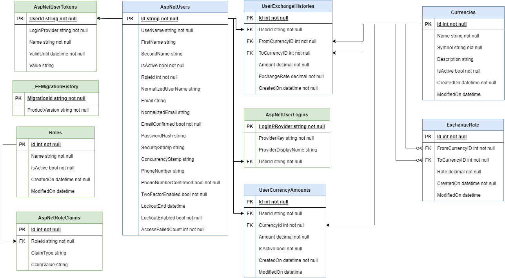

# Projekt Currencies
*Autorzy: Kamil Swiderski, Karina Tylmanowska, Julia Adamska, Michal Chudzik, Dawid Stepniewski*

## O projekcie

Projekt ma na celu stworzenie wielowarstowowej aplikacji do wymiany walut online. Platforma oferuje podstawowe funkcje, takie jak możliwość wymiany walut, rejestracja nowych użytkowników, oraz logowanie do konta. Użytkownicy będą mieć również dostęp do przeglądania aktualnych oraz historycznych kursów walut, co pozwoli im śledzić zmiany i podejmować świadome decyzje w zakresie wymiany walut. W ramach projektu skupiamy się na zapewnieniu intuicyjnej obsługi oraz stabilności działania systemu, z myślą o zwiększeniu wygody korzystania z niego przez naszych użytkowników.

## Jak uruchomić program

#### Backend:
- pobierz repoyztorium na swój komputer 
- otwórz folder w Visual Studio
- uruchom `Currencies.Api`
- otworzy się strona Swagger

#### Frontend: 
- pobierz repozytorium na swój komputer
- otwórz folder `Client` w Visual Studio Code
- wykonaj komende `npm install` w celu zainstalowania paczek
- wykonaj komende `ng serve` w celu uruchomienia aplikacji
- aplikacja będzie dostępna pod `http://localhost:4200/`

#### Baza danych:
- zainstaluj SQL Server
- wejdź na Visual Studio 
- wejdź w `Tools -> NuGet Package Manager -> Package Manager Console`
- W konsoli wpisz: `Update-Database`
- wejdź w `Tools -> Connect with database`
- server: `localhost\SQLEXPRESS`, baza: `CurrenciesDB`

##  Strona internetowa

Tutaj będzie opis strony...

## Baza danych 

W tej sekcji przedstawiamy strukturę oraz funkcje bazy danych, która będzie wspierać działanie naszej platformy do wymiany walut. Baza danych będzie oparta na relacyjnym modelu danych i zapewni niezbędną funkcjonalność do przechowywania informacji o użytkownikach, transakcjach oraz kursach walut.

#### Model bazy danych 

### Opis tabel

#### Tabela: ApplicationUser
- Przechowuje informacje o użytkownikach aplikacji.
- **Kolumny:**
  1. `Id`: Klucz główny identyfikujący użytkownika.
  2. `UserName`: Nazwa użytkownika.
  3. `FirstName`: Imię użytkownika.
  4. `SecondName`: Nazwisko użytkownika.
  5. `IsActive`: Określa czy konto użytkownika jest aktywne.
  6. `RoleId`: Identyfikator roli przypisanej do użytkownika (Klucz obcy).
  7. `NormalizedUserName`: Znormalizowana nazwa użytkownika.
  8. `Email`: Adres e-mail użytkownika.
  9. `NormalizedEmail`: Znormalizowany adres e-mail użytkownika.
  10. `EmailConfirmed`: Określa czy adres e-mail użytkownika został potwierdzony.
  11. `Adres`: Adres zamieszkania użytkownika.
  12. `IdentityNumber`: Numer pesel użytkownika.
  13. `IDNumber`:  Numer dokumentu tożsamości użytkownika.
  14. `IDExpiryDate`: Data wygaśnięcia dokumentu tożsamości.
  15. `IDIssueDate`: Data wydania dokumentu tożsamości.
  16. `PasswordHash`: Skrócona wartość hasła użytkownika.
  17. `SecurityStamp`: Unikalny znacznik zabezpieczeń.
  18. `ConcurrencyStamp`: Znacznik waluty.
  19. `PhoneNumber`: Numer telefonu użytkownika.
  20. `PhoneNumberConfirmed`: Określa czy numer telefonu użytkownika został potwierdzony.
  21. `TwoFactorEnabled`: Określa czy uwierzytelnianie dwuskładnikowe jest włączone dla użytkownika.
  22. `LockoutEnabled`: Określa czy blokada konta użytkownika jest włączona.
  23. `AccessFailedCount`: Licznik nieudanych prób logowania.
  24. `CreatedOn`: Data utworzenia rekordu w bazie danych.
  25. `ModifiedOn`: Data ostatniej modyfikacji rekordu.

#### Tabela: Currency
- Przechowuje informacje o dostępnych walutach.
- **Kolumny:**
  1. `Id`: Klucz główny identyfikujący walutę.
  2. `Name`: Nazwa waluty.
  3. `Symbol`: Symbol waluty.
  4. `Description`: Opis waluty.
  5. `IsActive`: Określa czy waluta jest aktywna.
  6. `CreatedOn`: Data utworzenia rekordu w bazie danych.
  7. `ModifiedOn`: Data ostatniej modyfikacji rekordu.

#### Tabela: ExchangeRate
- Przechowuje dane o wysokości kursów walut
- Tabela jest aktualizowana codziennie i przechowuje informacje historyczne 
- **Kolumny:**
  1. `Id`: Klucz główny identyfikujący kurs wymiany.
  2. `FromCurrencyID`: Identyfikator waluty źródłowej (Klucz obcy).
  3. `ToCurrencyID`: Identyfikator waluty docelowej (Klucz obcy).
  4. `Rate`: Kurs wymiany między walutami.
  5. `Direction`: Określa kierunek wymiany (kupno lub sprzedaż).
  6. `IsActive`: Określa czy kurs wymiany jest aktywny.
  7. `CreatedOn`: Data utworzenia rekordu w bazie danych.
  8. `ModifiedOn`: Data ostatniej modyfikacji rekordu.

#### Tabela: Role
- Przechowuje informacje o rolach użytkowników.
- **Kolumny:**
  1. `Id`: Klucz główny identyfikujący rolę.
  2. `Name`: Nazwa roli.
  3. `IsActive`: Określa czy rola jest aktywna.
  4. `CreatedOn`: Data utworzenia rekordu w bazie danych.
  5. `ModifiedOn`: Data ostatniej modyfikacji rekordu.

#### Tabela: UserCurrencyAmount
- Przechowuje informacje o ilości poszczególnych walut i stanie konta użytkowników.
- **Kolumny:**
  1. `Id`: Klucz główny identyfikujący ilość waluty użytkownika.
  2. `UserId`: Identyfikator użytkownika (Klucz obcy).
  3. `CurrencyId`: Identyfikator waluty (Klucz obcy).
  4. `Amount`: Ilość danej waluty w posiadaniu użytkownika.
  5. `IsActive`: Określa czy ilość waluty jest aktywna.
  6. `CreatedOn`: Data utworzenia rekordu w bazie danych.
  7. `ModifiedOn`: Data ostatniej modyfikacji rekordu.

#### Tabela: UserExchangeHistory
- Przechowuje historię transakcji wymiany walut użytkowników.
- Nowy rekord dodawany jest przy każdej wymianie waluty
- **Kolumny:**
  1. `Id`: Klucz główny identyfikujący historię wymiany użytkownika.
  2. `UserID`: Identyfikator użytkownika (Klucz obcy).
  3. `RateID`: Identyfikator kursu wymiany (Klucz obcy).
  4. `Amount`: Ilość wymienionej waluty.
  5. `ExchangeTime`: Data i czas wymiany waluty.
  6. `AccountID`: Identyfikator konta użytkownika.
  7. `PaymentStatus`: Status płatności.
  8. `PaymentType`: Typ płatności.
  9. `CreatedOn`: Data utworzenia rekordu w bazie danych.
  10. `ModifiedOn`: Data ostatniej modyfikacji rekordu.

#### Tabela: TokenUser
- Przechowuje dane tokenu użytkownika oraz datę jego ważności.
- **Kolumny:**
  1. `Id`: Klucz główny identyfikujący token użytkownika.
  2. `UserId`: Identyfikator użytkownika.
  3. `LoginProvider`: Dostawca logowania, który wygenerował token.
  4. `Name`: Nazwa tokenu.
  5. `ValidUntil`: Data ważności tokenu użytkownika.
  6. `Value`: Wartość tokenu.
